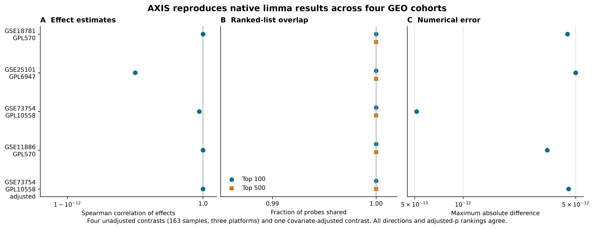

# Summary

Public molecular datasets can help researchers choose experiments and formulate
therapeutic hypotheses, but combining them safely is difficult. Study metadata
are inconsistent, biological samples may appear comparable while representing
different tissues or cell states, and thousands of cells from one person can be
mistaken for thousands of independent observations. AXIS is an open-source
Python command-line platform that connects study discovery, eligibility review,
quality control, differential expression, cross-study synthesis, single-cell
pseudobulk validation, target-evidence assessment, and reproducible reporting.

AXIS treats the participant as the biological unit, separates primary evidence
from broader sensitivity evidence, and preserves the provenance and permitted
scientific use of each result. It produces inspectable TSV and JSON outputs
rather than an opaque therapeutic score. Its outputs are research hypotheses,
not clinical recommendations or evidence of causality, efficacy, or safety.

# Statement of need

The NCBI Gene Expression Omnibus (GEO) provides a large archive of functional
genomics studies [@barrett2009geo]. Tools such as GEO2R make individual GEO
comparisons accessible by applying established Bioconductor methods, including
`limma` for microarrays and `DESeq2` for RNA sequencing. GEO2R is intentionally
restricted to comparisons within one GEO Series and can analyze Series whose
design or quality is unsuitable unless the researcher interprets the metadata
carefully [@geo2r]. Interactive systems such as iDEP support exploratory,
differential-expression, and pathway analysis from expression matrices
[@ge2018idep]. These tools solve important analysis problems but do not by
themselves govern whether heterogeneous studies can support the same claim.

AXIS addresses the surrounding evidence-synthesis problem. It records why a
study is eligible, binds approvals to analyzed-input checksums, distinguishes
compatible synthesis from sensitivity analysis, detects participant overlap,
and carries the resulting evidence into genetic, mechanistic, structural, and
pharmacological assessment. This is useful when the research question spans
multiple repositories, assay types, and evidence layers and when every step from
source record to proposed experiment must remain auditable.

# State of the field

`limma` provides mature empirical-Bayes linear modelling for expression data
[@ritchie2015limma], while pseudobulk approaches offer reliable participant-level
inference for replicated single-cell experiments [@murphy2022pseudobulk]. Open
Targets integrates genetics, tractability, safety, and drug-development evidence
for therapeutic hypothesis building [@ochoa2021opentargets;
@carvalho2025opentargets]. AXIS does not replace these specialized methods or
resources. It coordinates them within a conservative workflow and makes
eligibility, evidence role, participant independence, provenance, and claim
limits explicit computational objects.

The distinguishing contribution is therefore not a new differential-expression
test. It is a guarded path across discovery, analysis, synthesis, and target
assessment in which incompatible evidence remains stratified and a promising
expression direction cannot be silently promoted into a causal treatment claim.

# Software design

AXIS is implemented for Python 3.12 and exposes composable commands for study
cataloguing, downloading, sample preparation, analysis, recurrence ranking,
meta-analysis, target assessment, benchmarking, and report generation. A local
DuckDB evidence store separates source assertions, calculated evidence,
researcher hypotheses, and immutable provenance. Download manifests retain
source locations, retrieval dates, file sizes, and SHA-256 checksums.

For bulk microarrays, AXIS supports probe-to-gene mapping, multiple-testing
correction, moderated two-group contrasts, and declared covariate designs. For
single-cell RNA sequencing, counts are aggregated within participant and cell
type before group comparison. Cross-study operations preserve study-level
effects and require compatible definitions before random-effects synthesis.
Broader cell definitions or designs can be retained as sensitivity evidence
without increasing the primary evidence count.

Scientific guardrails are tested alongside numerical behavior. Eligibility
decisions are invalidated when their bound results change; outliers are reported
rather than silently removed; pooled libraries without participant replication
cannot be presented as participant-level validation; and pharmacological or
structural evidence cannot rescue a target lacking replicated biological
support and a defensible direction of intervention.

# Verification

The repository contains 146 automated tests and continuous integration for
Python 3.12 on Linux, macOS, and Windows. Static checks use Ruff and strict mypy.
A synthetic demonstration can run offline without redistributing frozen
participant data. The axial-spondyloarthritis reproduction verifies source
inputs and the dependency lockfile by SHA-256 and enforces 25 computational and
scientific claim checks.

The moderated microarray implementation was compared with native `limma` 3.68.4
under R 4.6.1 across four public GEO cohorts, 163 samples, and three platform
contexts. All probe-level effect directions agreed; effect-rank correlations
were approximately one; adjusted-p-value rank correlations were one; and the
top-100 and top-500 probe sets overlapped completely. Maximum absolute effect
differences were below $5.2\times10^{-12}$. A separate GSE73754 analysis using
group, sex, age, and numeric batch reproduced the same agreement across 47,323
shared probes. A frozen synthetic `limma` reference provides an offline
regression guard for coefficients, directions, and rankings.

# Research impact statement

AXIS has been used by its developers for a reproducible axial-spondyloarthritis
case study asking whether DDX24 expression differs in CD8 T cells between cases
and healthy controls. The primary analysis comprises two compatible cohorts (14
cases and 33 controls), while a broader third CD8 cohort is sensitivity-only.
The workflow generated a frozen reproduction, explicit claim limits, and a
prospective laboratory-validation protocol. The native-`limma` benchmark and
cross-platform test materials provide reproducible evidence of near-term
research significance. External adoption and peer-reviewed biological
validation have not yet been demonstrated.

# Limitations

The current biological demonstration is disease-specific and contains few
compatible cohorts. The native-`limma` benchmark covers four microarray cohorts;
paired designs, broader diseases, RNA-sequencing models, and additional
covariate structures require further validation. Human review remains necessary
for sample interpretation, eligibility, confounding, and biological meaning.
AXIS does not establish that a target is causal, safe, or therapeutically
effective. The project's public development history is recent and does not yet
demonstrate long-term maintenance or community adoption.

# Availability

AXIS is available from GitHub under the Apache License 2.0. The archived
software record is available from Zenodo [@axis2026]. Raw data that can be
retrieved reproducibly and frozen participant-level data that should not be
redistributed are excluded from the software archive.

# AI usage disclosure

Generative AI was used interactively to assist software implementation,
documentation, test design, and paper drafting. AI-generated code and text were
reviewed by the authors and checked using automated tests, static analysis,
cross-platform continuous integration, frozen checksums, native-`limma`
comparisons, and explicit scientific guardrails. AI output was not treated as
scientific evidence. The authors remain responsible for the software, its
interpretation, and the submitted manuscript.

# Acknowledgements

The authors declare no funding and no competing interests. Both authors must
approve the final submitted version. AXIS reuses de-identified public data; the
ethical and consent conditions of each source study remain applicable.

# References
